<div align="center">
  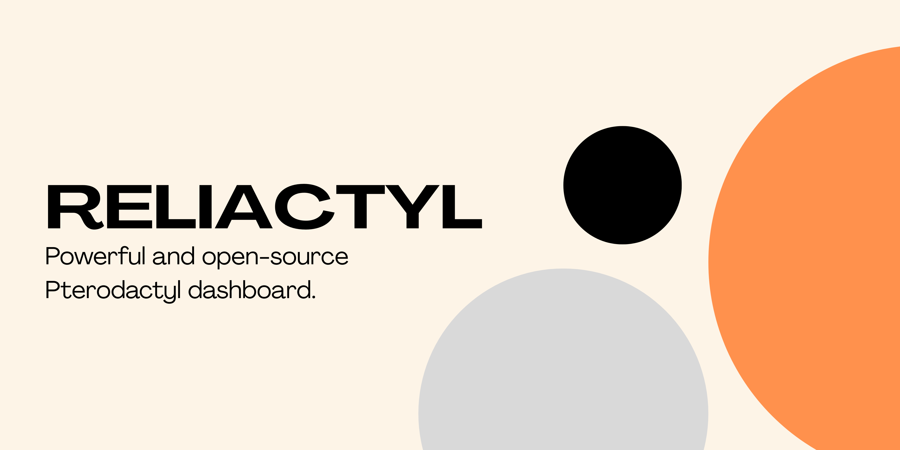
  
  # Reliactyl
  
  **Made with 💗 by [Danish](https://danishfolio.cc)**
  
  [](https://github.com/danishzzx/Reliactyl.git)
  
  <p>
    The best Pterodactyl client area. A feature-rich dashboard for managing resources, earning coins, and creating servers.
  </p>
</div>

---

## ✨ Features

Reliactyl comes packed with amazing features to enhance your Pterodactyl experience:

- 🪙 **Coins System**: Earn coins via AFK pages, Linkvertise, or gift them to others.
- 📦 **Resource Management**: Create servers, view resources, and gift resources to other users.
- 🛒 **Store**: Purchase additional resources (RAM, Disk, CPU, Slots) using earned coins.
- 💳 **Payments**: Integrated Stripe support for purchasing coins with real money.
- 🎟️ **Coupons**: Create and redeem coupons for resources and coins.
- 🔄 **Renewal System**: Require coins for server renewals to keep the economy active.
- 👥 **User System**: Complete authentication with Discord OAuth2, password regeneration, and more.
- 🚪 **Login Queue**: Prevent server overload during high traffic.
- 🎁 **Join for Rewards**: Incentivize users to join Discord servers for coin rewards.
- 📊 **Dashboard**: A beautiful and intuitive interface to view and manage resources.
- 🛠️ **Admin Panel**: profound control to set/add/remove coins & resources, create/revoke coupons, and more.
- 🔌 **API**: Built-in API for bots and external integrations.

---

## 📸 Screenshots

<div align="center">

| **Dashboard** | **Server Management** |
|:---:|:---:|
| 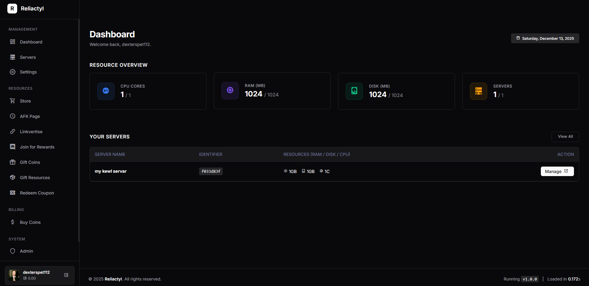 | 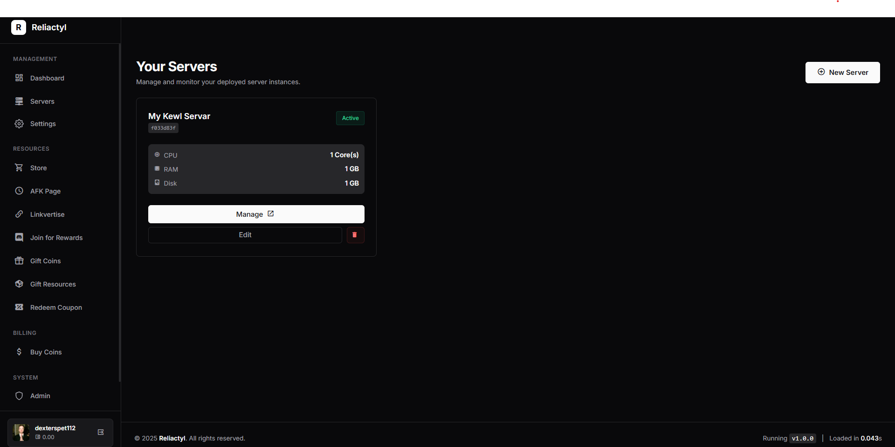 |

| **Store** | **Admin Panel** |
|:---:|:---:|
| 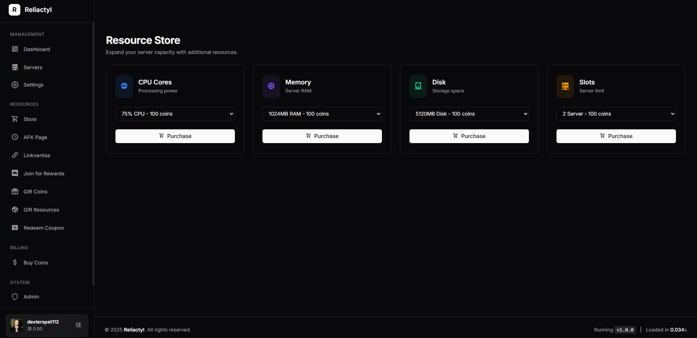 | 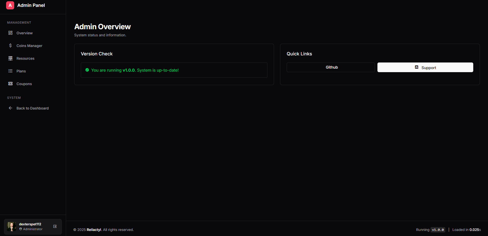 |

| **AFK Page** | **Settings** |
|:---:|:---:|
| 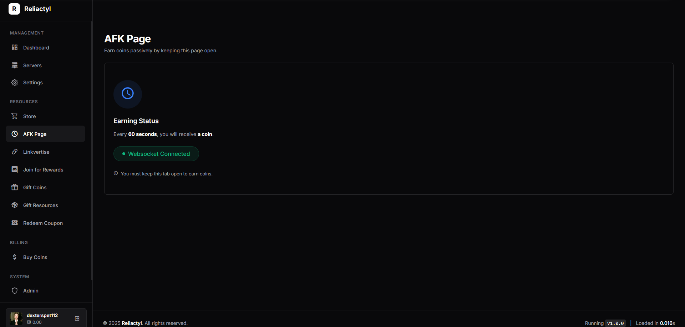 | 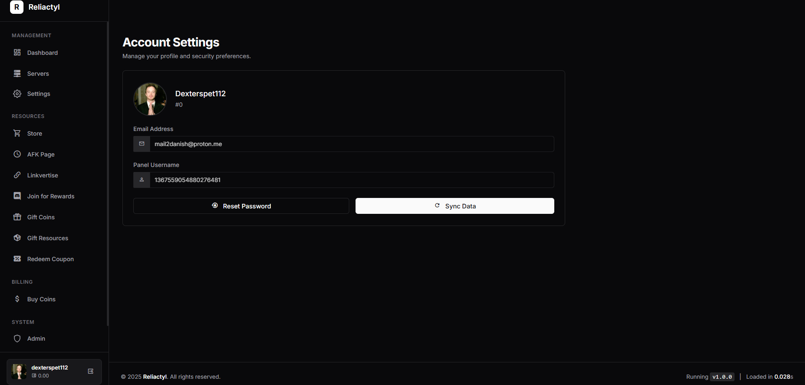 |

| **Gift Resources** | **Redeem Coupon** |
|:---:|:---:|
| 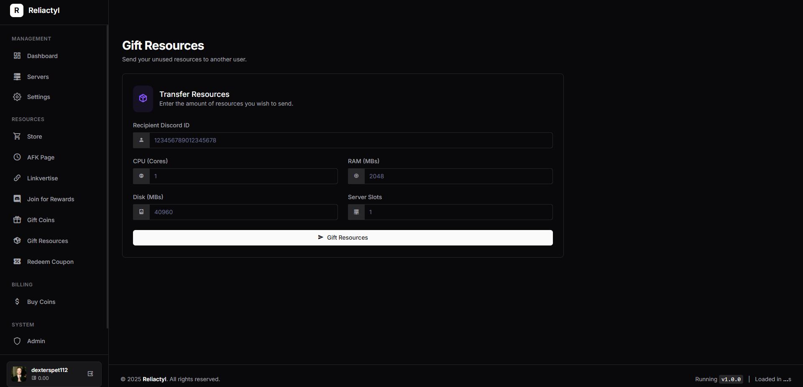 | 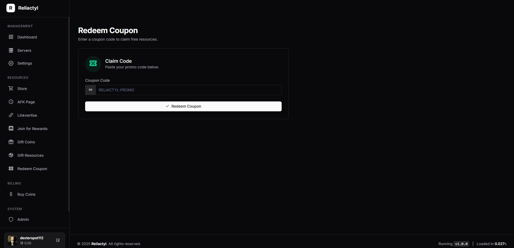 |

</div>

<details>
<summary>View More Screenshots</summary>
<br>
<div align="center">
  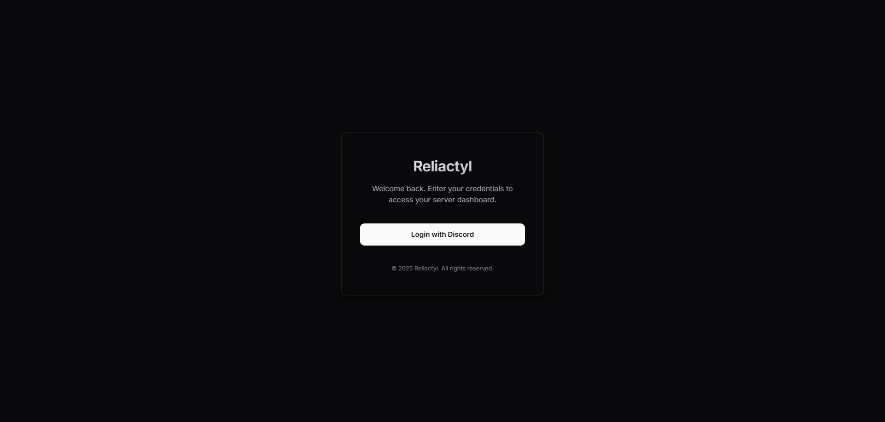
  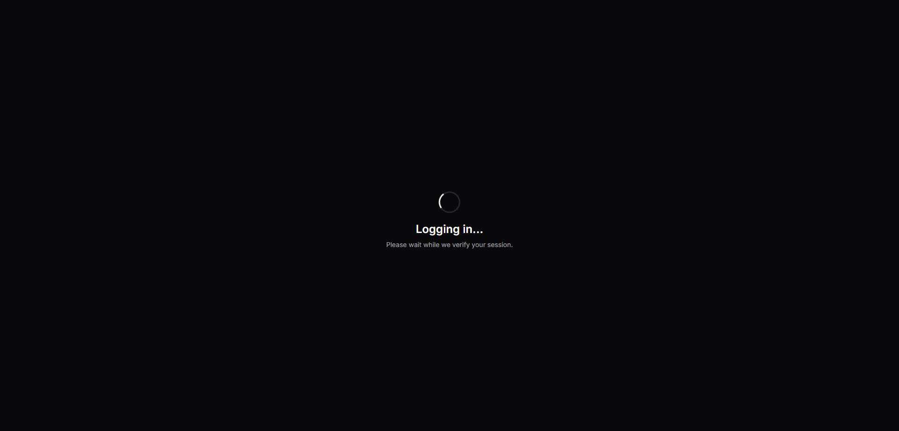
  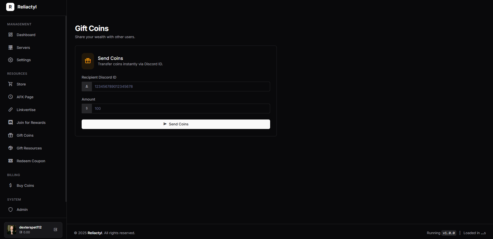
  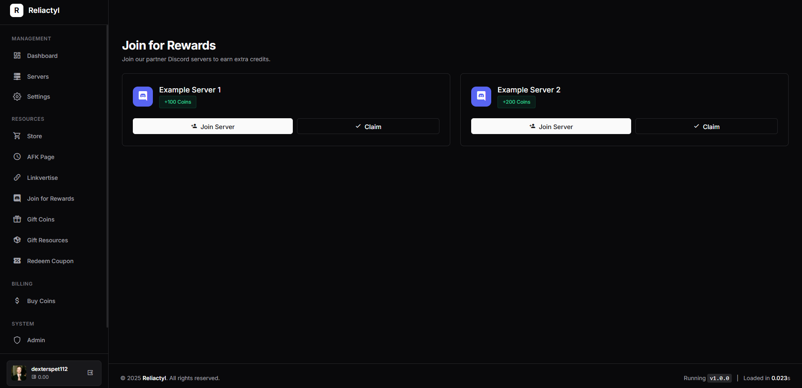
  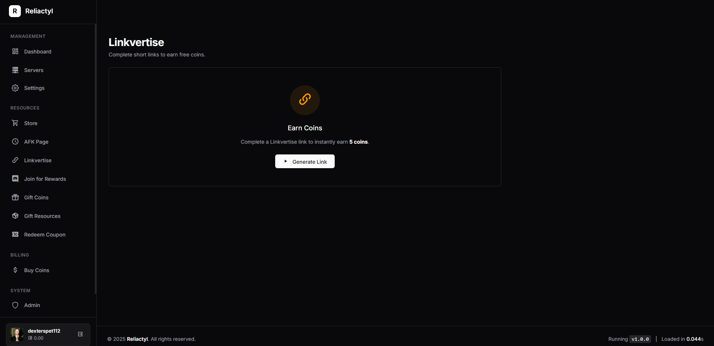
</div>
</details>

---

## 🚀 Getting Started

### Prerequisites
- Node.js (v14 or higher recommended)
- Pterodactyl Panel installed and configured

### Installation

1. **Clone the repository**
   ```bash
   git clone https://github.com/danishzzx/Reliactyl.git
   cd Reliactyl
   ```

2. **Install Dependencies**
   ```bash
   npm install
   ```

3. **Configuration**
   - Rename `settings.json` (if needed) or edit the existing `settings.json` file.
   - Fill in your **Discord OAuth2** details, **Pterodactyl** API information, and **Database** settings.
   - 📖 **[Read the detailed Configuration Guide](CONFIGURATION.md)** for a full explanation of every setting.
   - 🚀 **[Ready for Production? Read the Deployment Guide](DEPLOYMENT.md)** to set up SSL, Domain, and PM2.
   
   ```json
   {
     "pterodactyl": {
       "domain": "https://panel.yourdomain.com",
       "key": "your_api_key"
     },
     "api": {
       "client": {
         "oauth2": {
           "id": "your_discord_client_id",
           "secret": "your_discord_client_secret",
           "link": "http://your-domain.com"
         }
       }
     }
   }
   ```

4. **Start the Application**
   ```bash
   npm start
   # or for development
   npm run dev
   ```

---

## 💸 Support the Project

If you find this project helpful and want to support its development, you can donate via crypto:

| Currency | Address |
| :--- | :--- |
| **LTC (Litecoin)** | `LLy9cDwo6N2gGjsM2XwUg8Sb2FGYi3vmgX` |
| **BTC (Bitcoin)** | `bc1qa0rr2ruuw0ygpmwwvg5kchlywwfxxpa7j0sxk4` |
| **ETH (Ethereum)** | `0xb9F168D0d2b1cD9B838d918583Bdbc2a813e35Ef` |

> *All addresses are on their respective mainnets.*

---

## 🤝 Support & Credits

- **Developer**: [Danish](https://danishfolio.cc)
- **GitHub**: [danishzzx/Reliactyl](https://github.com/danishzzx/Reliactyl.git)

---

<div align="center">
  <sub>Made with ❤️ for the Pterodactyl Community</sub>
</div>

